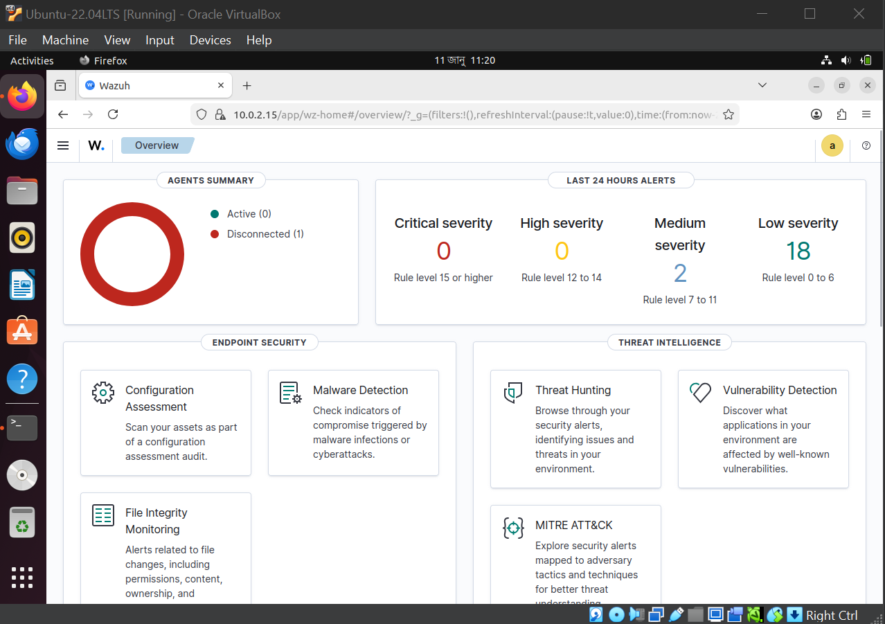
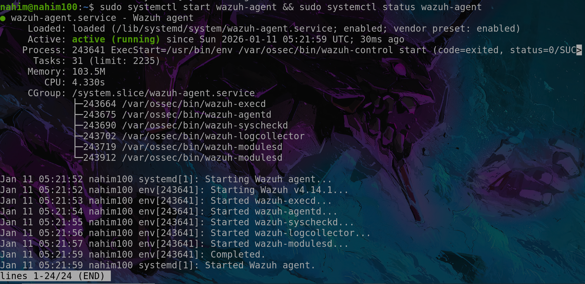
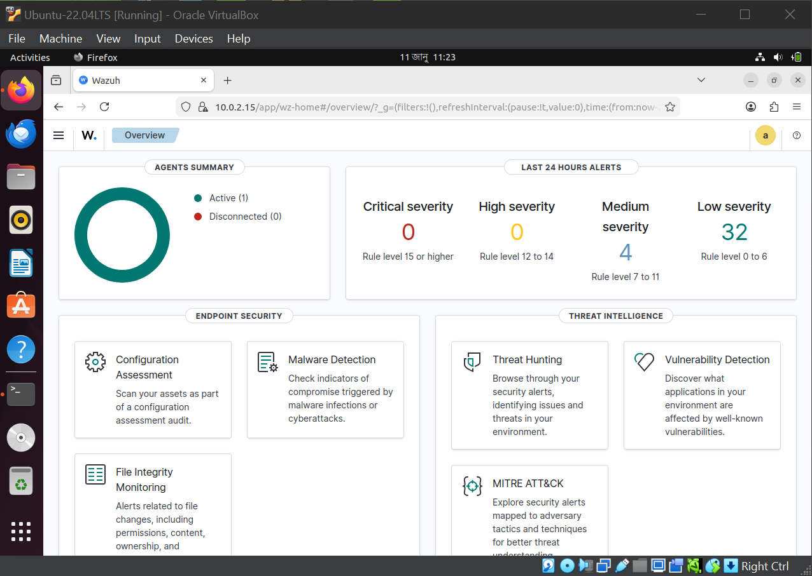
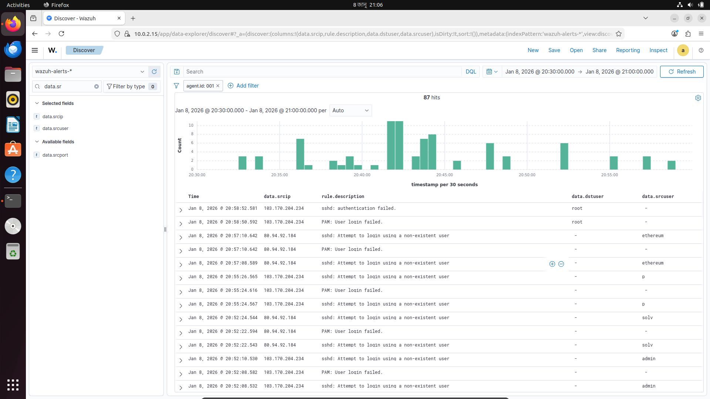

# Mini SOC Lab – Project Showcase

## 1. Project Overview

**Project Title:** Mini SOC (Security Operations Center) Lab using Wazuh  
**Objective:** Build a functional SOC lab to monitor, detect, and analyze security events using Wazuh Manager and Agents in a real-world–like environment.

This project demonstrates hands-on experience with:

- SIEM concepts
- Log collection and analysis
- Agent–manager architecture
- NAT traversal using Reverse SSH
- Incident detection and alerting

---

## 2. Architecture Diagram


**Architecture Description:**

- **Wazuh Manager (Ubuntu VM):** Central server running Wazuh Manager, Indexer, and Dashboard.
- **Wazuh Agent (VPS / Linux Host):** Collects system logs, security logs, web server logs and Vulnearble Server logs.
- **Network Challenge:** Manager behind NAT.
- **Solution:** Reverse SSH tunnel from Agent to Manager.

---

## 3. Lab Environment

| Component      | Details           |
| -------------- | ----------------- |
| Host OS        | Windows           |
| Virtualization | Oracle VirtualBox |
| Manager OS     | Ubuntu 22.04 LTS  |
| Agent OS       | Ubuntu 22.04 LTS  |
| SIEM Tool      | Wazuh 4.14.7      |
| Network Mode   | NAT + Reverse SSH |

---

## 4. Network & Connectivity Setup


### Data Flow Diagram

The Wazuh Manager includes wazuh-remoted, analysisd, the alert generator, and Filebeat. Data flows from Wazuh Agents to the Manager and then to the Wazuh Dashboard, where users can monitor and analyze logs. The Wazuh Indexer stores events efficiently and enables various search and analysis operations.

### Problem

- Manager VM is behind NAT
- Agent cannot directly reach Manager

### Solution

- Reverse SSH tunnel from Agent to Manager
- Agent connects to Manager via localhost tunnel

**Why Reverse SSH?**

- Bypasses NAT limitations
- Common real-world SOC workaround

---

## 5. Wazuh Installation Summary

### Manager Components

- Wazuh Manager
- Wazuh Indexer
- Wazuh Dashboard

### Agent

- Installed and registered to Manager
- Successfully connected and reporting


---

## 6. Agent Registration & Verification

- Agent added using authentication key
- Agent status verified from dashboard

**Proof:**

- Active agent visible in Wazuh Dashboard
- Logs being received in real time


---

## 7. TEST Alert Monitoring:

### Test Scenario: Successfull root access

**Steps:**

```bash
ssh nahim@vpsIP
```

**Result:**

- Wazuh detects root access
- Alert generated with severity level

**Alert Information:**

- Timestamp
- Attacker IP
- Attack Descriptions
- Data Source User
- Data Destination User

**Alert Decisions**  
false positive as Admin/owner can trigger this event


---

### Test Scenario: Failed SSH Login

**Steps:**

```bash
ssh root@vpsIP
```

**Result:**

- Wazuh detects authentication failure
- Alert generated with severity level

**Alert Information:**

- Timestamp
- Attacker IP
- Attack Descriptions
- Data Source User
- Data Destination User

**Alert Decisions**  
True Positive; As the attacker failed to login multiple time


---

### Test Scenario: Web-Directory Brute Force

**Steps:**

```bash
ffuf url/FUZZ -w /usr/local/share/wordlist/smallDir.txt
```

**Result:**

- Wazuh detects multiple GET request from same IP Source
- Alert generated with severity level

**Alert Information:**

- Timestamp
- Protocol
- Path
- Attempts
- Attacker IP
- Attack Description
- Log Location
- Attacker Location

**Alert Decisions**  
True Positive; As the attacker perform Directory BruteForcing


---

## 8.Real-Time Attack Monitoring:

### Attack Scenario: SSH Brute Force

- Attack Type: Credential Access
- Target: SSH Service
- Detection Tool: Wazuh

**Observed Behavior**

- Multiple failed login attempts
- Same source IP
- Different usernames

**Detection Details**

- Rule Level: 10
- MITRE ATT&CK: T1110
- Source IP: `45.135.232.92`, `193.46.255.217`, `193.46.255.159`, `193.46.255.7`, `80.94.93.233`, `45.135.232.92`, `193.46.255.244`, `80.94.93.119`, `193.46.255.7`


**Outcome**

- Attack successfully detected
- Alerts visible in Wazuh Dashboard

**Decision**  
True Positive; As the attacker tried multiple times which denoted as Critical Threat Level 10-SSH BruteForce

---

### Attack Scenario: Web Attack

- Attack Type: Login Bypass, Parameter Query, Enumeration
- Target: Vulnerable Docker Web Service (Flask)
- Detection Tool: Wazuh

**Observed Behavior**

- Login attempts
- Parameter Exploitations
- Directory Enumerations

**Detection Details**

- Suspecious Geo Locations
- Suspecious Parameter
- No of Attempts
- Source IP: `204.96.203.18`, `130.12.180.18`, `5.187.35.158`, `91.224.92.14` and SO on...


**Outcome**

- Attack successfully detected
- Alerts visible in Wazuh Dashboard

**Decision**  
True Positive; As the attack try to grab the Server Details and perform Malicious Parameterized Query

---

## 9. Logs & Analysis

- Agent logs: `/var/ossec/logs/ossec.log`
- Apache logs: `/var/log/apache2/access.log`, `/var/log/apache2/error.log`
- My Vuln Lab Logs: `/var/log/vulab1/flask/access.log`
- System Logs: `/var/log/auth.log`
- Manager processes incoming logs
- Indexer stores searchable data

This demonstrates full **log → analysis → alert** pipeline.

---

## 10. Challenges Faced & Solutions

| Challenge            | Solution                             |
| -------------------- | ------------------------------------ |
| NAT connectivity     | Reverse SSH tunnel                   |
| Agent not connecting | Version & key mismatch fix           |
| Indexer issues       | Clean reinstall & correct cert setup |
| Network confusion    | IP tracing and routing analysis      |
| Custom Log Format    | Create custom decode formater        |
| My Lab Custom Rules  | Write custom rules for my Vuln Lab   |

---

## 11. Key Learning Outcomes

- Understanding SIEM architecture
- Agent–manager communication
- Real-world networking challenges
- Log-based threat detection
- Troubleshooting complex Linux services
- Build Custom Rules, Log Format
- Build My own Vulnerable Lab and Monitoring them perfectly
- Solutions perfectly Detectes Real Time Threats in my VPS

---

## 12. Conclusion

This Mini SOC Lab demonstrates practical SOC skills using open-source tools. It reflects real-world scenarios such as NAT traversal, centralized monitoring, incident detection, VPS real-time monitoring, custom log formats, and custom alert rules.

This mini lab assembles real-life solutions to a significant extent. Due to low computer specifications, I faced several challenges, including:

- Slow system response
- Frequent crashes
- Pipeline crashes
  Despite these difficulties, I successfully overcame the issues. Below is the complete Mini SOC Lab project.

**Prove**  
The Agent and Manager communicate in real time. Initially, the Agent is disconnected. The VPS then starts the Agent, after which the Agent comes back online and functions correctly.

| Agent Disconnected                      | Start Agent from VPS                    | Agent Online                      | Agent Working                      |
| --------------------------------------- | --------------------------------------- | --------------------------------- | ---------------------------------- |
|  |  |  |  |

This project strengthens hands-on cybersecurity and SOC analyst capabilities.

---

## 13. Author

**Name:** Rakib Ul Islam Nahim  
**Role:** Cybersecurity Student / SOC Learner  
**Focus Areas:** SOC, SIEM, Blue Teaming

---

_(End of Project Showcase)_
